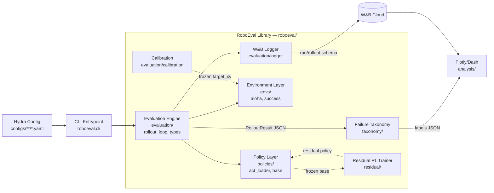
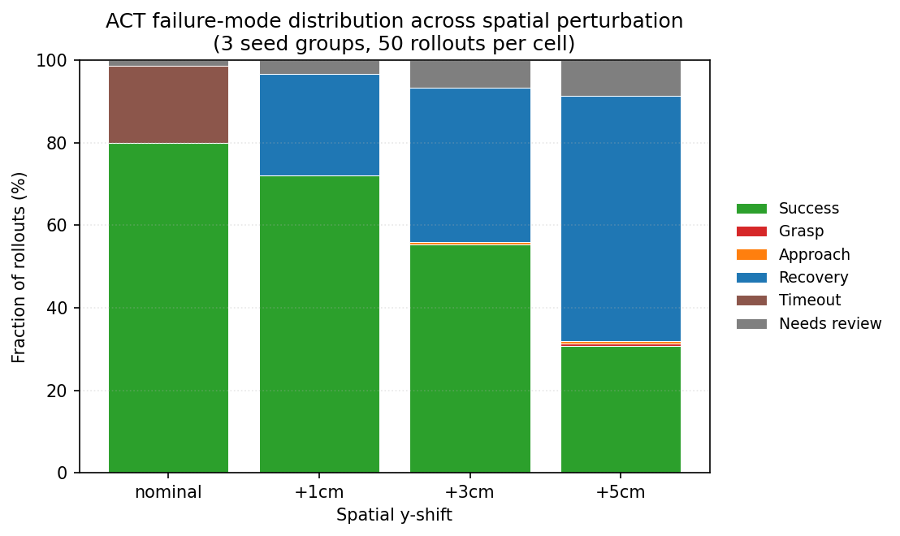
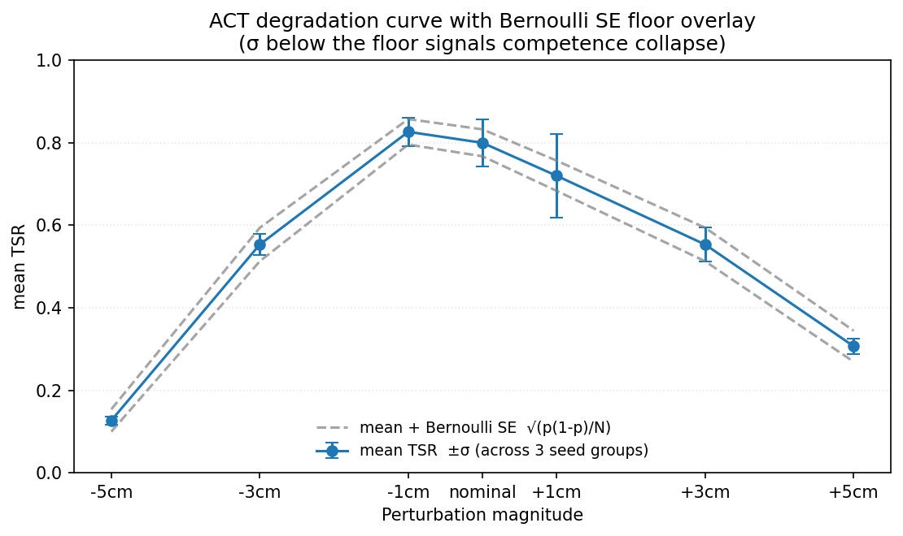
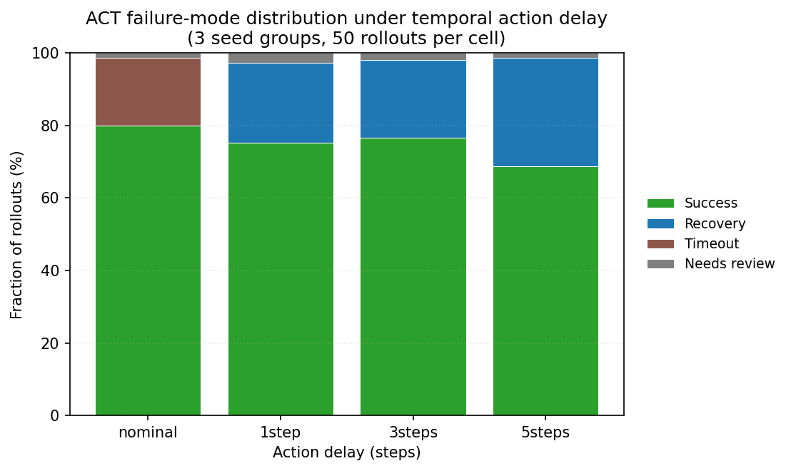
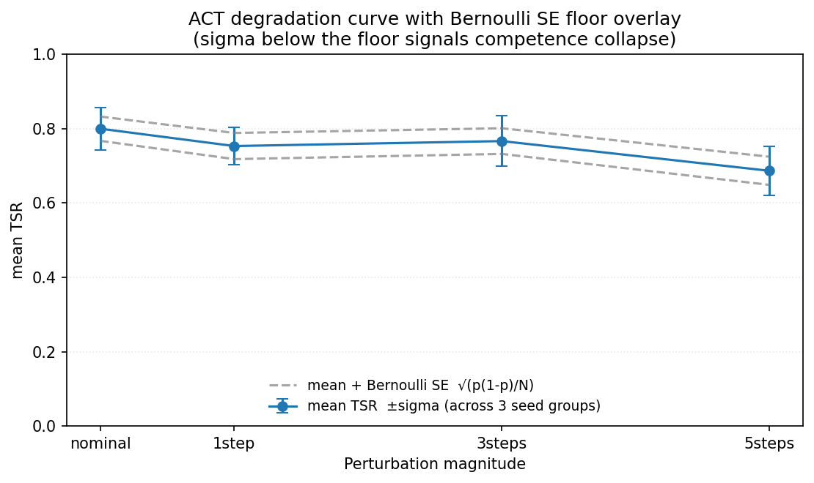

# RoboEval — Product Requirements Document

**Author:** Rubeno Dechua
**Status:** v1.0 — Approved
**Last Updated:** May 2026
**Target Role:** Robot Learning Engineer

> **One-line pitch.** RoboEval is an open-source evaluation harness and study that systematically measures where state-of-the-art imitation learning policies break, classifies failure modes, and demonstrates a residual RL loop that recovers the top-frequency failure — producing a reproducible benchmark, an interactive dashboard, and an arXiv-style writeup ready for submission.

---

## 1. Executive Summary

Robot learning is transitioning from laboratory demonstrations to production deployments. The dominant paradigm — imitation learning via Behavioral Cloning, ACT, and Diffusion Policy — has achieved impressive task success in controlled conditions. However, the field lacks a rigorous, publicly available study of where these policies systematically fail, how failure modes distribute across policy architectures, and whether lightweight residual RL can recover them.

RoboEval closes that gap. The project delivers:

- **An evaluation harness** that benchmarks multiple pretrained policies in simulation with a single config change
- **A robustness suite** that quantifies policy degradation under distribution shift, physical perturbation, and visual noise
- **A failure taxonomy** with six operationally-defined categories, a classifier, and per-policy breakdown
- **A residual RL study** showing whether PPO-based fine-tuning can recover the highest-frequency failure mode
- **A public deliverables package** including an interactive dashboard, demo video, MkDocs site, and arXiv-style writeup

**Why this project for Rubeno specifically.** Rubeno spent 8+ months at Physical Intelligence evaluating real robot policies, identifying failure modes, and documenting instructional frameworks — this project is a public, reproducible extension of that exact workflow. It fills the gap between industry experience and open-source portfolio signal that robot learning hiring teams need to see.

---

## 2. Problem Statement

### 2.1 The Gap in the Field

State-of-the-art robot manipulation policies (ACT, Diffusion Policy, π0) are benchmarked primarily on task success rate in nominal conditions. Three critical gaps remain:

- No standardised public evaluation harness exists for comparing these policies under consistent conditions.
- Failure modes are qualitatively described in papers but rarely quantified, classified, or cross-compared across policy architectures.
- The value of lightweight residual RL on top of pretrained imitation policies is understood in theory but almost no public implementation with measured results exists for newcomers to the field.

### 2.2 The Gap for an Early-Career Robot Learning Engineer

New-grad and early-career robot learning candidates typically demonstrate:

- Toy RL implementations (CartPole, MuJoCo Ant) that every CS grad has done
- Course or Kaggle projects with no deployment or reproducibility discipline
- No public evidence of being able to design an experiment, run it cleanly, and communicate the results

RoboEval is designed to fill all three gaps simultaneously and produce artifacts that map directly to responsibilities listed in Robot Learning Engineer and Autonomy Evaluation Engineer job descriptions.

---

## 3. Goals & Non-Goals

### 3.1 Goals

1. Build and open-source a reproducible policy evaluation harness runnable on Apple M1 (8 GB RAM) with no GPU required for evaluation.
2. Benchmark Policy A (`lerobot/act_aloha_sim_transfer_cube_human`) from the LeRobot model zoo under baseline and perturbed conditions. Build the harness as policy-agnostic so additional policies (e.g. a community-trained Diffusion Policy) can be added in v1.1 via a single config flag.
3. Define, operationalise, and classify at least 6 failure mode categories across ≥150 labelled rollouts.
4. Train a residual PPO policy on top of the highest-frequency failure mode and report ΔTSR (task success rate improvement) with ablations.
5. Produce a public demo video, interactive Plotly/Dash dashboard, arXiv-style PDF writeup, and MkDocs documentation site.
6. Complete all of the above in 10 weeks on a part-time schedule (~15–20 hrs/week).

### 3.2 Non-Goals

The following are explicitly out of scope for v1.0 to protect timeline:

- Training a full policy from scratch — this requires compute we do not have and adds no differentiation over existing work
- Real-robot deployment — sim-only is sufficient and is the standard for eval research
- CUDA / GPU infrastructure — M1 MPS and Colab Pro overflow handle all compute needs
- Novel algorithm contributions — this is an empirical study, not a methods paper
- Comparison to proprietary models (π0, RT-2, Helix) — no public checkpoints available
- **Cross-policy comparison in v1.0** — no sim-trained Diffusion Policy checkpoint exists publicly for ALOHA Transfer Cube (see §6.1). v1.0 is single-policy (ACT); cross-policy comparison and the multi-policy perturbation grid are deferred to v1.1 as a stretch goal contingent on training Diffusion Policy from scratch on Colab or the appearance of a community checkpoint.
- **Multi-policy perturbation grid** — for the same reason, the perturbation suite in §6.4 runs on ACT only in v1.0. This keeps the 10-week timeline feasible on a single M1 (see §11).

---

## 4. Target Audience

### 4.1 Primary — Hiring Teams at Robot Learning Companies

The project's core external audience is recruiting and engineering teams at companies hiring for Robot Learning Engineer, Autonomy Evaluation Engineer, and ML Research Engineer roles. Specific targets:

- **Manipulation-focused:** Physical Intelligence, Skild AI, 1X Technologies, Figure AI, Dexterity, Covariant
- **Humanoid / mobility:** Boston Dynamics AI Institute, Apptronik, Agility Robotics
- **Autonomy evaluation adjacent:** General Motors Autonomy, Waymo, Cruise Automation

### 4.2 Secondary — The Robot Learning Research Community

Open-sourcing the harness and study benefits researchers who want a plug-and-play evaluation baseline. GitHub stars, forks, citations, and community issues all add long-term professional signal.

### 4.3 Tertiary — The Author

The project functions as structured upskilling. Every phase introduces a concept that will come up in technical interviews: reward design, RL training loops, statistical experimental design, and research communication.

---

## 5. Technical Architecture

### 5.1 System Overview

RoboEval is structured as a Python library with four major runtime components — **Environment Layer**, **Policy Layer**, **Evaluation Engine**, and **Analysis & Reporting Layer** — orchestrated by Hydra configuration files and logged to Weights & Biases.



**Architecture Principle.** Every experiment must be fully reproducible from a single YAML config file. Given a config, the eval harness produces identical results (modulo fixed random seed) with one command:

```bash
roboeval evaluate --config configs/baseline/act_nominal.yaml
```

### 5.2 Repository Structure

```
roboeval/
├── configs/              # Hydra YAML configs per experiment
│   ├── baseline/         # Nominal eval configs (one per policy)
│   ├── perturbation/     # Robustness suite configs
│   └── residual_rl/      # PPO fine-tuning configs
├── roboeval/             # Core library (typed Python)
│   ├── envs/             # Environment wrappers (Gymnasium API)
│   ├── policies/         # Policy loader + inference wrappers
│   ├── evaluation/       # Rollout engine, metric collectors, logger
│   ├── taxonomy/         # Failure mode classifier
│   └── residual/         # Residual RL trainer (SB3 PPO)
├── analysis/             # Notebooks + Plotly dashboard
├── data/                 # Frozen artifacts (see §5.4)
│   ├── calibration/      # Calibrated success-detector thresholds
│   ├── runs/             # Per-run rollout artifacts (jsonl)
│   └── taxonomy/         # Auto + manual labels per run
├── docs/                 # PRD, research log, MkDocs source
├── tests/                # pytest unit + integration tests
├── .github/workflows/    # CI: lint, type-check, smoke-test
├── pyproject.toml        # Ruff, mypy, dependency config
└── README.md
```

### 5.3 Technology Stack

| Category | Tool / Library | Purpose | M1 Compatible |
|---|---|---|---|
| Simulation | MuJoCo 3 + gym-aloha | Primary manipulation env | ✓ CPU/MPS |
| Simulation (fallback) | PyBullet | Lightweight alternative env | ✓ CPU |
| Policies | LeRobot (HuggingFace) | ACT & Diffusion Policy checkpoints | ✓ MPS inference |
| RL Training | Stable-Baselines3 | PPO residual policy training | ✓ MPS |
| RL Training | Gymnasium | Environment wrapper API | ✓ |
| Config Mgmt | Hydra | Reproducible experiment configs | ✓ |
| Logging | Weights & Biases (free tier) | Run tracking, plots, artifacts | ✓ (cloud) |
| Visualization | Plotly + Dash | Interactive eval dashboard | ✓ |
| Viz (static) | Seaborn + Matplotlib | Publication-quality plots | ✓ |
| Code Quality | Ruff + mypy + pre-commit | Linting, typing, git hooks | ✓ |
| CI/CD | GitHub Actions | Auto-test on push | ✓ (cloud) |
| Docs | MkDocs + mkdocstrings | Auto-generated API docs site | ✓ |
| GPU Overflow | Google Colab Pro (~$10/mo) | Larger inference, RL training | N/A — cloud |

### 5.4 Data & Artifact Management

Every experiment produces artifacts on three tiers; what each is, where it lives, and how it is versioned is explicit:

| Artifact | Location | Versioning | Retention |
|---|---|---|---|
| **Per-rollout results** (observation summary, actions, reward trace, success flags, perturbation params) | `data/runs/{run_sha}/rollouts.jsonl` | Tagged with `git_sha`, `wandb_run_id`, `config_hash` | Kept through v1.0; pruned to top-50 representative rollouts at v1.1 |
| **Aggregated run summary** (TSR, TTS, σ across seeds, per-condition table) | W&B run + `data/runs/{run_sha}/summary.json` | W&B run ID is the canonical identifier | Kept indefinitely (W&B free tier) |
| **Calibrated success-detector thresholds** | `data/calibration/transfer_cube_target_xy.json` | Frozen; references the calibrating run_sha | Kept indefinitely |
| **Taxonomy labels** | `data/taxonomy/{auto,manual,relabel_sample}_labels_{run_sha}.json` | Frozen per run_sha; manual labels written ≥7d after auto labels (see §7.3) | Kept indefinitely |
| **Trained residual policies** | `data/residual/{run_sha}/ppo_residual.zip` + W&B artifact | W&B artifact version + run_sha | Top-3 by ΔTSR kept; rest pruned |
| **Plots & figures for writeup** | `analysis/figures/{topic}_{run_sha}.svg` | Regenerated from `analysis/notebooks/*.ipynb` | Kept; referenced in PDF & MkDocs |

**Reproducibility contract.** Any artifact in `data/` is uniquely traceable to (a) the git SHA of the code that produced it, (b) the Hydra config hash, and (c) the W&B run ID. All three are written into the artifact's JSON header. No artifact is overwritten in-place; a new run produces a new `run_sha` directory.

---

## 6. Evaluation Design

### 6.1 Policies Under Study

v1.0 benchmarks a single pretrained policy, selected for public availability of a sim-trained checkpoint compatible with the MuJoCo gym-aloha Transfer Cube task:

- **Policy A — ACT (Action Chunking with Transformers):** HuggingFace ID `lerobot/act_aloha_sim_transfer_cube_human`. Transformer-based; outputs action chunks; reports ~83% task success rate at 80k training steps on the source task. Verified to exist on the HuggingFace Hub (May 2026).

Diffusion Policy was originally planned as Policies B and C. A May 2026 audit of the public `lerobot/*` HuggingFace organisation confirmed that **no sim-trained Diffusion Policy checkpoint exists for ALOHA Transfer Cube**: only `lerobot/diffusion_pusht` and `lerobot/diffusion_pusht_keypoints` are published, both for the PushT task. Training Diffusion Policy from scratch on the `lerobot/aloha_sim_transfer_cube_human` dataset is out of scope for v1.0 (see §3.2) and is deferred to v1.1 as a stretch goal.

If the ACT checkpoint proves incompatible with M1 MPS inference, a CPU-only fallback will substitute. Colab Pro is reserved for inference runs exceeding 4 GB VRAM.

### 6.2 Evaluation Tasks

All evaluations use the gym-aloha manipulation environment (part of the LeRobot ecosystem), which runs on CPU without CUDA:

- **Transfer Cube Task** — Move a cube from one receptacle to another. Standard, well-understood baseline task.
- **Insertion Task (stretch goal)** — Insert a peg into a socket. Higher precision requirement, exposes more failure modes.

**Task success criterion (Transfer Cube).** v1.0 tracks two success signals side-by-side and logs both to W&B.

- **Primary TSR (`mean_tsr`)** uses gym-aloha's native `info["is_success"]` flag, which is set when the dm_control task reward reaches its maximum value of 4 — operationally, "left gripper holds the cube AND the cube is not touching the table" (see `gym_aloha/tasks/sim.py::TransferCubeTask.get_reward`). This is the signal that the `lerobot/act_aloha_sim_transfer_cube_human` model card uses to report its ~83% TSR figure; adopting it as primary preserves direct comparability with the checkpoint's published number.

- **Secondary TSR (`mean_tsr_custom`)** uses a PRD-defined geometric criterion implemented in `roboeval.envs.success.TransferCubeSuccessDetector`: cube centre-of-mass z-position exceeds `z_threshold_m` **and** xy-position lies within a half-width `xy_tolerance_m` box around the target receptacle centre, sustained for `dwell_steps` consecutive simulation steps. `z_threshold_m = 0.05 m` is the PRD constant; `target_xy` and `xy_tolerance_m` are calibration-derived (90th-percentile endpoint distance from centroid; calibration completed Week 2.5, frozen at `data/calibration/transfer_cube_target_xy.json` and pulled into configs via the `${calibration:...}` OmegaConf resolver). The custom signal is the one reported throughout the perturbation suite (§6.4), where the contact-based primary signal may become unreliable under physical perturbation (e.g. a held but misplaced cube).

**Note on `dwell_steps` and gym-aloha termination semantics.** gym-aloha's TransferCube env sets `terminated = (reward == 4)` on the same env step that flips `info["is_success"]` to `True` (see `gym_aloha/env.py`). The rollout loop breaks immediately, so the dwell counter has at most one in-zone step before the episode ends — `dwell_steps > 1` would miss the "snap success" case where the cube reaches the target on the same step the grip event flips `is_success`. Nominal-condition configs therefore use `dwell_steps = 1`. Perturbation suite configs (Week 4) may use higher `dwell_steps` to discriminate transient pass-throughs from stable hold.

**Calibration ceiling on agreement.** Because `xy_tolerance_m` is the 90th percentile of successful-endpoint distances from the centroid, ~90% of primary successes have their endpoint inside the zone by construction. Expected agreement is therefore `mean_tsr_custom ≈ 0.9 × mean_tsr_native` under nominal conditions. The remaining ~10% gap is the endpoint-distribution tail and is interpretable as the "fraction of held-but-loosely-placed cubes" signal — a feature rather than a bug for perturbation analysis, where loosely-placed cubes are exactly what we want to flag.

### 6.3 Metrics

| Metric | Definition | Source | Target |
|---|---|---|---|
| Task Success Rate (TSR) | % rollouts completing task end-to-end | Custom eval loop | Reported mean ± std |
| Time-to-Success (TTS) | Median steps to task completion | Rollout logs | Reported |
| Perturbation Recovery Rate | TSR after mid-rollout object shift | Eval harness | > baseline TSR × 0.5 |
| Failure Mode Distribution | % rollouts per failure category | Taxonomy classifier | ≥5 categories populated |
| Residual RL Delta (ΔTSR) | TSR improvement over frozen base policy | Ablation table | > +10% on target failure |
| Eval Reproducibility (σ) | Std dev across 3 seed groups, ≥50 rollouts each | Eval harness | σ < 7% |

**Statistical bar.** All metrics are reported as mean ± standard deviation across 3 random seeds and ≥50 rollouts per condition. This is the minimum bar for results to be credible in a research context. The σ < 7% target on TSR reproducibility is set above the irreducible per-seed-group Bernoulli SE of ~5.7% at p ≈ 0.8 and N = 50; tightening the bar would require N ≥ 100 per seed, which doubles compute without commensurate insight.

### 6.4 Robustness Perturbation Suite

The perturbation suite stresses **Policy A (ACT) only** in v1.0 (see §3.2 for rationale and v1.1 expansion plan) along four axes. Each axis defines a range of perturbation intensities; axes are tested **independently** (one perturbation per rollout) to keep the failure attribution clean. Multi-axis crossing is a v1.1 stretch.

| Axis | Perturbation | Intensities |
|---|---|---|
| Spatial | Object start position shifted from nominal | ±1 cm, ±3 cm, ±5 cm |
| Visual | Lighting intensity variation; distractor object | ±30%, ±60%; distractor present/absent |
| Dynamic | Object pushed 2 cm mid-rollout at fixed nominal-completion fraction | at 25%, 50%, 75% of nominal completion |
| Temporal | Action execution delayed (simulates latency) | 1, 3, 5 steps |

Each (axis, intensity) cell runs 3 seeds × 50 rollouts = 150 rollouts. Total perturbation suite budget: ~1,800 rollouts (4 axes × ~3 intensities × 150). **v1.0 status: 10 of ~24 cells run (spatial 7/7 cells across −5 → +5 cm; temporal 3/3 cells at 1/3/5-step delay). Visual and dynamic axes are scaffolded but deferred to v1.1 — the spatial + temporal pair already supplies a cross-axis comparison (§6.4.2); adding the remaining axes would add polish, not insight.**

### 6.4.1 Results — Spatial and Temporal Axes

**Spatial axis (7 cells, n = 150 per cell):**

| Δy | TSR | σ | Dominant failure |
|---|---|---|---|
| −5 cm | 0.127 | 0.009 | Recovery 80.7%, Approach 4.7% |
| −3 cm | 0.553 | 0.025 | Recovery 42.0% |
| −1 cm | 0.827 | 0.034 | Recovery 17.3% |
| nominal | 0.800 | 0.057 | Timeout 18.7% |
| +1 cm | 0.720 | 0.102 | Recovery 24.7% |
| +3 cm | 0.553 | 0.041 | Recovery 37.3% |
| +5 cm | 0.307 | 0.019 | Recovery 59.3% |





Three findings from the spatial axis (full analysis: `research-log.md` Week 5 Day 2):

1. **The degradation curve is asymmetric and non-monotonic at small magnitudes.** At ±1 cm, −1 cm slightly outperforms nominal (+2.7 pp) while +1 cm is meaningfully worse (−8.0 pp). At ±3 cm the cells collide. At ±5 cm the asymmetry flips: −5 cm (0.127) is dramatically worse than +5 cm (0.307). Mechanistic hypothesis: the cube's nominal start at y ≈ 0.5 places it at the right-arm's habituated pickup zone; small −y stays in that zone while small +y already drifts out, but large −y simultaneously breaks both right-arm pickup and left-arm receive.
2. **σ collapse signals competence collapse.** σ at ±5 cm sits **below** the Bernoulli SE floor √(p(1−p)/N), indicating deterministic failure (same seed → same outcome). σ at +1 cm is 2.8× the floor — variable, seed-dependent. This distinction matters for Phase 4: deterministic failures admit a learnable correction; variable failures don't.
3. **Approach Failure appears only at −5 cm** (4.7% vs ≤ 0.7% elsewhere). The first per-cell qualitative shift in the suite — at large negative shifts the policy reaches past where it expects the cube to be, terminating > 5 cm from the (shifted-away) cube.

**Temporal axis (3 cells + nominal, n = 150 per cell):**

| delay | TSR | σ | Dominant failure |
|---|---|---|---|
| nominal | 0.800 | 0.057 | Timeout 18.7% |
| 1 step | 0.753 | 0.050 | Recovery 22.0% |
| 3 steps | 0.767 | 0.068 | Recovery 21.3% |
| 5 steps | 0.687 | 0.066 | Recovery 30.0% |





Three findings from the temporal axis (full analysis: `research-log.md` Week 5 Day 3):

1. **Temporal degrades much more gently than spatial.** 5-step delay loses only 11 pp of TSR; +5 cm spatial loses 49 pp; −5 cm spatial loses 67 pp. ACT's 100-step action chunking and temporal-ensembling absorb most of the latency — a 5-step delay shifts the executed plan by 5% of one chunk while the geometric task structure is unchanged.
2. **No competence collapse on the temporal axis.** σ stays super-Bernoulli at every cell (ratio 1.4× – 1.9× the floor). Failures are variable, not deterministic.
3. **Non-monotonic at small delays.** 1-step delay (0.753) is within noise of 3-step delay (0.767) — the TSR landscape has a flat valley near nominal, consistent with the chunk-absorbed regime.

### 6.4.2 Cross-Axis Synthesis

The central Phase-3 finding is that **ACT's failure morphology is policy-architecture-specific, not perturbation-axis-specific**. Both axes produce dominantly Recovery failures (≥95% of all failures across the 10 cells we ran): the policy reaches a position consistent with its nominal expectations, recognises something is off, and **stalls quietly** rather than attempting active correction. Action-level pathologies (Oscillation) and outcome-specific failures (Grasp, Approach) are rare — Approach appears at one cell, Grasp at one cell, Oscillation never.

What differs across axes is **elasticity**:

| | spatial (−5 → +5 cm) | temporal (0 → 5 steps) |
|---|---|---|
| TSR range | 0.127 → 0.827 | 0.687 → 0.800 |
| Max degradation vs nominal | 67 pp (at −5 cm) | 11 pp (at 5 steps) |
| σ behaviour at extremes | sub-Bernoulli (deterministic) | super-Bernoulli (variable) |
| Mechanism | no learned trajectory passes through the perturbed cube position | 100-step chunks + temporal-ensembling absorb latency |

This shapes the Phase-4 design (§8): **the residual RL base-policy target is the +5 cm spatial cell.** Recovery-dominant failures plus deterministic σ collapse make the corrective signal a small spatial nudge that a small MLP can learn via PPO. Temporal would need a fundamentally different residual architecture (e.g., predict-actions-N-steps-ahead) — out of scope for v1.0. Phase 4 evaluates the residual on +5 cm and tests transfer to +3 cm and −5 cm to confirm it learned a "spatial correction" rather than overfitting to one cell.

---

## 7. Failure Mode Taxonomy

### 7.1 Design Principles

The taxonomy is designed to be operationally unambiguous: any two labellers should agree on the failure category for a given rollout. Each category has a precise definition, a concrete example, and a measurable detection rule.

### 7.2 Taxonomy

| Category | Definition | Detection Rule (operationally measurable) |
|---|---|---|
| Grasp Failure | Robot contacts object but drops or misses | Finger-object contact at any step **and** terminal cube z < 0.02 m |
| Approach Failure | Robot reaches wrong position/orientation before contact | End-effector terminal pose error > 5 cm from cube COM **and** no contact in episode |
| Recovery Failure | Policy cannot correct after perturbation | Perturbation applied (any axis) **and** terminal TSR = 0 **and** action variance post-perturbation < 0.1 |
| Action Oscillation | Policy outputs rapidly alternating contradictory actions | Action sign-flip rate > 5 per 10-step window for >5 steps |
| Timeout | Task not completed within step budget (default **400 steps** for Transfer Cube; tunable per task in Hydra config) | Episode hits step cap **and** no progress (cube displacement < 1 cm) in last 50 steps |
| Visual Confusion | Policy error correlates with visual change (lighting, distractor) | TSR drops > 30% under changed visual condition **and** TSR ≥ 70% in nominal |

### 7.3 Labelling Protocol

1. Run evaluation harness; save full rollout trajectory (observations, actions, rewards) per episode.
2. Auto-classify rollouts into failure categories using a rule-based classifier from the detection rules above.
3. Manually review a stratified sample of 30 rollouts (5 per category) to validate classifier accuracy.
4. Validate the rule-based classifier via a single-labeller **blinded self-relabel**: export a stratified sample of 30 rollouts (5 per category) with auto-labels redacted, wait ≥7 days for a memory-wash, then manually re-label the sample blind to the auto-labels. Compute **Cohen's κ** between auto and manual labels. Target **κ > 0.6** (substantial agreement per Landis & Koch 1977; the standard for single-labeller robotics evals where wider single-labeller CIs preclude the 0.7 threshold used in multi-labeller settings). Blinding is enforced by storing auto-labels in `data/taxonomy/auto_labels_{run_sha}.json` (frozen) and the redacted sample in `data/taxonomy/relabel_sample_{run_sha}.json`; the manual labels are written to `data/taxonomy/manual_labels_{run_sha}.json` ≥7 days later (enforced via the `data/taxonomy/relabel_unlock_at` timestamp file the labelling script reads).
5. Produce per-policy failure distribution heatmap.

**Edge cases.** Rollouts that match zero categories or multiple categories are flagged into a `needs_review` bucket and reviewed manually. The bucket size is reported alongside the heatmap.

---

## 8. Residual RL Design

### 8.1 Rationale

Residual RL trains a small correction policy on top of a frozen base policy. Rather than replacing the base policy, it learns to predict the delta between what the base policy does and what should be done in failure-prone states. This is much cheaper to train than a policy from scratch and maps directly to real-world workflows where pretrained policies are valuable but imperfect.

**Why Residual RL and not Full RL from scratch?** Full RL from scratch on manipulation tasks requires millions of environment steps and significant GPU time — not feasible on M1 8 GB. Residual RL operates in a narrow region of the action space near the base policy, converges faster, and is the approach actually used by robot learning teams to iterate on deployed policies. This choice demonstrates research taste, not hardware limitation.

### 8.2 Implementation

- **Base policy** — Frozen ACT checkpoint (Policy A); selected for the highest failure rate in the most targeted failure category as identified in Phase 3.
- **Residual policy** — Small MLP, 2 hidden layers × 256 units, GELU activations. **Input:** concatenation of (current observation features from the ACT encoder, base action chunk). **Output:** same dimension as the action space (`gym-aloha` action dim = 14 for bimanual). Trained with PPO via Stable-Baselines3.
- **Reward signal** — Sparse success reward (+1 on `is_success`, 0 otherwise) + shaped distance-to-goal term (negative L2 distance of cube COM to target receptacle), ablated separately.
- **Training budget** — 500k environment steps. Estimated wall-clock revised in §10.2.1; final estimate to be set after Week 6 baseline.
- **Action composition** — Final action `a = a_base + α × a_residual`, where `α` is a **learnable scalar** initialised at 0.1 with sigmoid clipping to [0, 1]. The clipping ensures the residual cannot fully replace the base.

### 8.3 Ablation Plan

Three conditions are reported. Each condition is run with **3 seeds × 50 rollouts** on the target failure mode (matching the §6.3 statistical bar):

| Condition | Description |
|---|---|
| A — Frozen base only | ACT policy, no residual (baseline) |
| B — Residual RL, sparse reward | PPO residual with binary success signal |
| C — Residual RL, shaped reward | PPO residual with distance-to-goal shaping |

**Reporting.** Per-condition TSR is reported as mean ± std. ΔTSR is the difference of means; significance is tested with a one-sided Welch's t-test (α = 0.05) across the 3-seed group means. A positive ΔTSR > 10% on the target failure mode is the success criterion. A negative or null result is still reported with analysis — honest null results are valued in research.

---

## 9. Deliverables

| Deliverable | Description | Audience Signal |
|---|---|---|
| GitHub Repository | Typed Python codebase, CI, full README, MIT license, one-command eval | Robot learning / MLOps teams |
| Evaluation Harness | Pluggable harness: swap policy or env with single config change | Infra / research engineers |
| Benchmark Report (PDF) | arXiv-style writeup: method, results, ablations, limitations | Research-leaning hiring managers |
| Interactive Dashboard | Plotly/Dash web app: filter by policy, metric, failure mode | Product / applied ML teams |
| Demo Video (90s) | Screen-recorded rollouts showing key failure modes + recovery delta | All recruiters — top of funnel |
| MkDocs Site | Auto-generated API docs, hosted on GitHub Pages | Engineering due-diligence |
| W&B Report | Public Weights & Biases run dashboard with all metrics | ML practitioners |

### 9.1 Industry-Standard Quality Checklist

Every deliverable must pass the following before public release:

- **GitHub repository** — zero lint errors (Ruff), zero mypy `--strict` type errors, CI passing on push, >70% test coverage on `roboeval/`, README with one-command eval instructions, MIT license file present.
- **Writeup** — methods section reproducible from description alone; results section includes uncertainty estimates (mean ± std, N, seed count); limitations section present and honest; every figure has a caption with axis labels and units.
- **Dashboard** — loads in <3 seconds; mobile-responsive; all plots have axis labels, units, and titles; failure-mode filter works without page reload.
- **Demo video** — narrated; failure modes visually annotated; ≤90 seconds; 1080p minimum.
- **MkDocs site** — all public functions documented; quickstart example runs without modification on a fresh clone.

### 9.2 Quality Gates Between Phases

A phase is not "done" — and the next phase does not start — until the gate below passes. Each gate maps to the Definition of Done (§10.3) for the project as a whole.

| Gate | Phase Closing | Pass Criteria |
|---|---|---|
| **G1 — Foundation** | End of Phase 1 (Week 1) | Repo public, CI green on `main`, pre-commit hooks installed, MPS verified on M1 (`torch.backends.mps.is_available() == True`), smoke rollout renders without crash. |
| **G2 — Baseline** | End of Phase 2 (Week 3) | Hydra-driven evaluate CLI working end-to-end; ACT mean TSR within ±5 percentage points of the model card's ~83% claim on the source task; σ < 7% across 3 seeds × 50 rollouts; harness loads any LeRobot policy through a single config flag (policy-agnostic protocol). |
| **G3 — Robustness & Taxonomy** | End of Phase 3 (Week 5) | Perturbation TSR table complete for ACT across all 4 axes; ≥150 rollouts auto-labelled; classifier validated via blinded relabel with Cohen's κ > 0.6; all 6 categories populated with ≥20 examples; `needs_review` bucket reported. |
| **G4 — Residual RL** | End of Phase 4 (Week 7) | PPO residual training curves visible in W&B; ablation table complete with all 3 conditions × 3 seeds × 50 rollouts; ΔTSR reported with t-test significance; honest write-up of null result if not >10%. |
| **G5 — Communication** | End of Phase 5 (Week 8) | Plotly/Dash dashboard deployed at a public URL; 90-second demo video uploaded; blog post draft circulated for review. |
| **G6 — Launch** | End of Phase 6 (Week 10) | All Definition-of-Done bullets (§10.3) true; v1.0 git tag pushed; LinkedIn/r/ML announcement posted. |

**Gate failure protocol.** If a gate does not pass at the planned week, do not proceed to the next phase. Either (a) extend that phase by ≤1 week, eating buffer from Week 9–10, or (b) descope (move work to v1.1) per §3.2. Never push downstream work onto an unmet gate — that's how scope creep eats a 10-week plan.

---

## 10. Project Plan

### 10.1 Phase Overview

| Phase | Name | Key Deliverables | Duration |
|---|---|---|---|
| 1 | Foundation & Environment Setup | Repo scaffold, env verified, CI passing | Week 1 |
| 2 | Baseline Policy Evaluation | Baseline metrics on Policy A (ACT); policy-agnostic harness v1 | Weeks 2–3 |
| 3 | Robustness & Failure Mode Study | Perturbation suite, failure taxonomy, ablation plots | Weeks 4–5 |
| 4 | Residual RL Fine-tuning | Trained residual policy, delta metrics, ablation | Weeks 6–7 |
| 5 | Dashboard & Writeup | Plotly dashboard, blog post draft, demo video | Week 8 |
| 6 | Polish & Launch | Peer review, README, arXiv-style PDF, public release | Weeks 9–10 |

### 10.2 Week-by-Week Schedule

Based on 15–20 focused hours per week, executable alongside part-time or full-time work.

| Wk | Phase | Tasks | Done When… |
|---|---|---|---|
| 1 | Setup | Repo scaffold, CI, env install, smoke-test policy rollout | First rollout renders without crash |
| 2 | Eval v1 | Baseline TSR on Policy A (ACT), 50 rollouts, log to W&B | W&B dashboard showing TSR ± std |
| 3 | Eval v1 | Generalise harness to policy-agnostic loader (ready for v1.1 DP); expand ACT baseline to 3 seeds × 50 rollouts × nominal conditions | Harness loads any LeRobot policy via single config flag; ACT baseline TSR ± std logged to W&B (gate G2) |
| 4 | Robustness | Perturbation suite (ACT only): object shift, lighting, distractor, action delay | Perturbation TSR table complete for Policy A |
| 5 | Failure Study | Failure taxonomy: label 150+ rollouts, build classifier, plot distribution | Taxonomy heatmap + per-policy breakdown (gate G3) |
| 6 | Residual RL | PPO residual policy setup; train on top-1 failure mode in sim | Training curve visible in W&B |
| 7 | Residual RL | Ablation: residual vs. frozen baseline; compute ΔTSR | Ablation table with ≥3 conditions (gate G4) |
| 8 | Comms | Plotly dashboard; 90-second demo video; blog post draft | Dashboard deployed; video uploaded (gate G5) |
| 9 | Polish | arXiv-style PDF; MkDocs site; peer review (1 external reader) | PDF readable start-to-finish |
| 10 | Launch | Tag v1.0 release; post on LinkedIn + r/MachineLearning; cold outreach | 5+ GitHub stars within first week (gate G6) |

### 10.2.1 Measured Compute Footprint (M1 MPS, May 2026)

Wall-clock measured on the Apple M1 (8 GB) with MPS active, after the Week 2 verification smoke (`act_nominal_fast.yaml`):

- **Per ACT rollout:** 5.4–13.2 s (avg ~8 s; spread driven by the ACT chunk-queue refill cadence — every ~50 steps the queue empties and a full transformer forward pass adds ~200 ms).
- **Full nominal eval** (`act_nominal.yaml`, 3 seeds × 50 rollouts, 400-step cap): **~20–25 minutes**. Originally estimated at 2.5–4 hours assuming CPU inference; MPS delivers a ~10× speedup on the convnet backbone.
- **Perturbation suite** (Week 4, ACT only, 4 axes × ~3 intensities × 3 seeds × 50 rollouts ≈ 1,800 rollouts): **~4 hours**. Originally estimated at multi-day on CPU.
- **Residual RL training** (Week 6–7, 500k env steps): still the dominant compute cost; revise the M1 estimate in §8.2 only once Week 6 baseline data is in.

**Implication.** The full nominal run is now a coffee-break task, not an overnight task. §11's "Eval is too slow on CPU" risk row is consequently downgraded to Low likelihood; CPU fallback remains the contingency for any future MPS regression.

### 10.3 Definition of Done

The project is done when all of the following are true simultaneously:

- GitHub repo is public, CI is green, and README produces a working eval run on a fresh clone
- All 6 failure categories have ≥20 labelled rollout examples
- Residual RL ablation table shows results for all 3 conditions with ≥3 seeds
- Dashboard is deployed and accessible via public URL
- Blog post is published (GitHub Pages, Medium, or personal site)
- Demo video is posted on YouTube or LinkedIn

---

## 11. Risks & Mitigations

| Risk | Likelihood | Impact | Mitigation |
|---|---|---|---|
| Real-trained checkpoint loaded into sim env | Medium | Near-zero baseline TSR; eval results uninterpretable | Only use sim-trained variants from the LeRobot zoo (e.g. `lerobot/act_aloha_sim_transfer_cube_human`); verify on Day 1 by running the nominal-condition rollout and confirming TSR > 50% before any further work |
| M1 RAM OOM during inference | High | Blocks eval loop | Use smaller ACT checkpoint; reduce batch size to 1; fallback to PyBullet env |
| LeRobot API breaking changes | Medium | Eval harness breaks | Pin dependency versions (`lerobot==0.4.4` in pyproject.toml); CI rebuilds clean Ubuntu on every push to catch regressions |
| Residual RL doesn't improve TSR | Medium | Weak project story | Reframe as negative result with analysis — still publishable; focus writeup on failure taxonomy instead |
| Eval is too slow on CPU | Low | Limits rollout count | MPS verified on M1 in Week 2 (~8 s per ACT rollout, ~20 min for the full 150-rollout nominal). CPU fallback (`device: cpu` in eval config) remains the contingency for MPS regression; AsyncVectorEnv parallelisation is reserved for that contingency rather than required upfront |
| Project scope creep | High | Misses 10-week target | Lock MVP scope at end of Phase 2; additional features go to backlog (v1.1); §9.2 phase gates block downstream work on unmet upstream criteria |
| PRD-implementation drift | Medium | Code goes one way, writeup another; reduces credibility | `prd-check` skill invoked before any non-trivial feature work; weekly research-log entry cross-references PRD sections actually touched |
| W&B free-tier limit hit mid-project | Low | Logging interrupted | Free tier covers ~100 GB; full perturbation suite estimated <5 GB. Local jsonl logs are the source of truth; W&B is the dashboard, not the storage |

---

## 12. Success Criteria

### 12.1 Project Success (Technical)

- Evaluation harness runs Policy A (ACT) end-to-end without manual intervention, and is policy-agnostic enough to accept a second LeRobot policy via config change with no code changes
- At least 150 rollouts classified into failure taxonomy; rule-based classifier validated via a 30-rollout self-relabel with blinding (≥7-day gap) reaching Cohen's κ > 0.6 (substantial agreement)
- Residual RL ablation complete with all 3 conditions and error bars
- All 7 deliverables shipped to public-facing channels

### 12.2 Career Success (Hiring Signal — Aspirational)

External validation is partially outside the author's control. These targets are tracked but not project-blocking:

- GitHub repository receives ≥5 stars within 2 weeks of launch
- At least 1 cold outreach to a robot learning company receives a positive response citing the project
- Project is discussed substantively in at least 1 technical interview
- At least 1 hiring manager or researcher comments on or shares the writeup / dashboard

### 12.3 Personal Learning Success

- Able to explain reward design tradeoffs (sparse vs. shaped vs. learned) from first principles
- Able to walk through a residual RL training loop in a whiteboard interview without notes
- Familiar with at least 3 papers per topic area covered in the writeup's related work section

---

## 13. Interview Question Alignment

| Interview Question | Project Artifact | Answer Angle |
|---|---|---|
| Walk me through a time you evaluated a model rigorously | Eval harness + metrics table | Built reproducible harness; ran 50 rollouts per config; reported mean ± std across 3 seeds |
| How do you design a reward function? | Reward ablation in Phase 4 | Compared sparse vs. shaped; showed tradeoffs in sample efficiency and reward hacking |
| What does sim-to-real gap mean to you? | Phase 3 perturbation study | Systematically varied physics/visual params in sim; quantified TSR degradation curves |
| Have you worked with RL on real systems? | Physical Intelligence experience + residual RL | Evaluated physical robot policies at PI; project extends that to RL fine-tuning in sim |
| Tell me about a failure and what you learned | Failure taxonomy section | Classified 6 failure modes; recovery rate metric; residual RL targeted the highest-frequency failure |
| How do you communicate technical findings? | Dashboard + blog post + video | Built interactive Plotly dashboard; wrote arXiv-style report; produced 90-second demo video |

---

## 14. Setup Log (Historical — Phase 1 Complete)

The original "Day 1 Checklist" is preserved here as a setup record. **Phase 1 was closed at the end of Week 1**; the items below are the state on which all subsequent work rests. Current project state and weekly journal live in `docs/research-log.md`.

1. GitHub repository created: `RDechua/roboeval` — public, MIT license, Python .gitignore.
2. `uv` installed: `curl -LsSf https://astral.sh/uv/install.sh | sh`.
3. Project environment: `uv venv .venv && source .venv/bin/activate`.
4. Core dependencies pinned in `pyproject.toml` — `lerobot==0.4.4`, `gymnasium`, `mujoco`, `stable-baselines3`, `hydra-core`, `wandb`, `plotly`, `ruff`, `mypy`.
5. M1 MPS availability verified: `torch.backends.mps.is_available() == True`.
6. LeRobot smoke test passed. **Note:** LeRobot 0.4.x removed the `lerobot.common` namespace; policies import directly from `lerobot.policies.*`.
7. W&B project created: `roboeval`.
8. Pre-commit hooks installed (`ruff`, `mypy --strict`, end-of-file-fixer, trailing-whitespace).
9. Reading completed: ACT (Zhao et al. 2023), Diffusion Policy (Chi et al. 2023), Residual Policy Learning (Silver et al. 2019).

**The Most Important Instruction in This Document.** The gap between a good project and a great one is the writeup. Code without communication is invisible. Every week, write one paragraph describing what you did, what surprised you, and what you plan next. The blog post writes itself from these notes. Do not leave writing until Week 8. (Status: `docs/research-log.md` maintained weekly through Week 2.5.)

---

## Appendix A — Reference Papers

The minimum reading list before and during the project. Reading these is what allows the writeup to situate itself credibly in the field:

- **ACT** — Zhao et al. (2023). *Learning Fine-Grained Bimanual Manipulation with Low-Cost Hardware*. RSS 2023.
- **Diffusion Policy** — Chi et al. (2023). *Diffusion Policy: Visuomotor Policy Learning via Action Diffusion*. RSS 2023.
- **LeRobot** — Cadene et al. (2024). *LeRobot: State-of-the-art Machine Learning for Real-World Robotics*. GitHub.
- **Residual RL** — Silver et al. (2019). *Residual Policy Learning*. arXiv:1812.06298.
- **IRIS / Interactive Learning** — Mandlekar et al. (2020). *IRIS: Implicit Reinforcement without Interaction*. ICRA 2020.
- **Robomimic** — Mandlekar et al. (2021). *What Matters in Learning from Offline Human Demonstrations for Robot Manipulation*. CoRL 2021.
- **VLA Survey** — Firoozi et al. (2023). *Foundation Models in Robotics: Applications, Challenges, and the Future*. arXiv:2312.07843.

## Appendix B — Glossary

| Term | Definition |
|---|---|
| ACT | Action Chunking with Transformers — a transformer-based imitation learning policy that outputs action chunks rather than per-step actions. Zhao et al. 2023. |
| Cohen's κ | Inter-rater agreement coefficient corrected for chance. κ > 0.6 indicates substantial agreement (Landis & Koch 1977). Used here to validate the rule-based failure classifier against a blinded manual self-relabel. |
| DP | Diffusion Policy — a visuomotor policy that models the action distribution via denoising diffusion. Chi et al. 2023. Out of scope for v1.0 (no public ALOHA-Transfer-Cube checkpoint). |
| gym-aloha | Gymnasium environment wrapping ALOHA bimanual manipulation tasks in MuJoCo, distributed with LeRobot. |
| LeRobot | HuggingFace open-source robotics library hosting policy implementations, datasets, and model checkpoints. Pinned at v0.4.4 in this project. |
| MPS | Apple's Metal Performance Shaders backend — PyTorch's GPU acceleration on Apple Silicon. ~10× speedup over CPU on the ACT convnet backbone (§10.2.1). |
| MuJoCo | Physics simulator used by gym-aloha. The dm_control suite (which gym-aloha wraps) sets `info["is_success"]` from the underlying task reward. |
| PPO | Proximal Policy Optimization (Schulman et al. 2017). The on-policy RL algorithm used for residual training, implemented via Stable-Baselines3. |
| Residual RL | Training paradigm where a small policy `π_res` is learned on top of a frozen base `π_base`; the executed action is `π_base(s) + α · π_res(s)`. See Silver et al. 2019. |
| run_sha | Short identifier composed of git SHA + W&B run ID + config hash. Every artifact in `data/` is tagged with its `run_sha` for traceability (§5.4). |
| SB3 | Stable-Baselines3 — Python RL algorithm library used here for PPO. |
| TSR | Task Success Rate — fraction of rollouts that complete the task. v1.0 reports both `mean_tsr` (gym-aloha native) and `mean_tsr_custom` (geometric criterion, §6.2). |
| TTS | Time-to-Success — median number of simulation steps to task completion across successful rollouts. |
| σ (sigma) | Standard deviation of TSR across 3 seed groups (each ≥50 rollouts). Target σ < 7% (§6.3). |
| ΔTSR | TSR(residual condition) − TSR(frozen base). Primary residual-RL outcome metric. Target ΔTSR > +10 pp on the target failure mode (§8.3). |

---

*Document prepared by Rubeno Dechua — May 2026. RoboEval is an independent portfolio project. All tools referenced are open-source or free-tier.*
