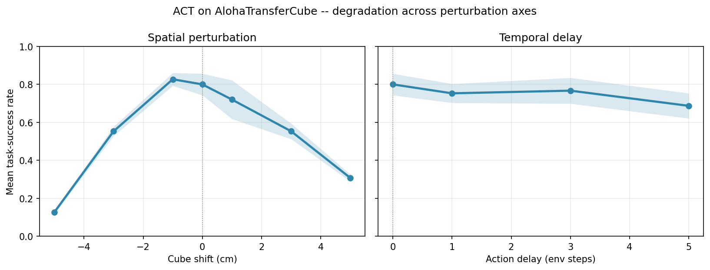
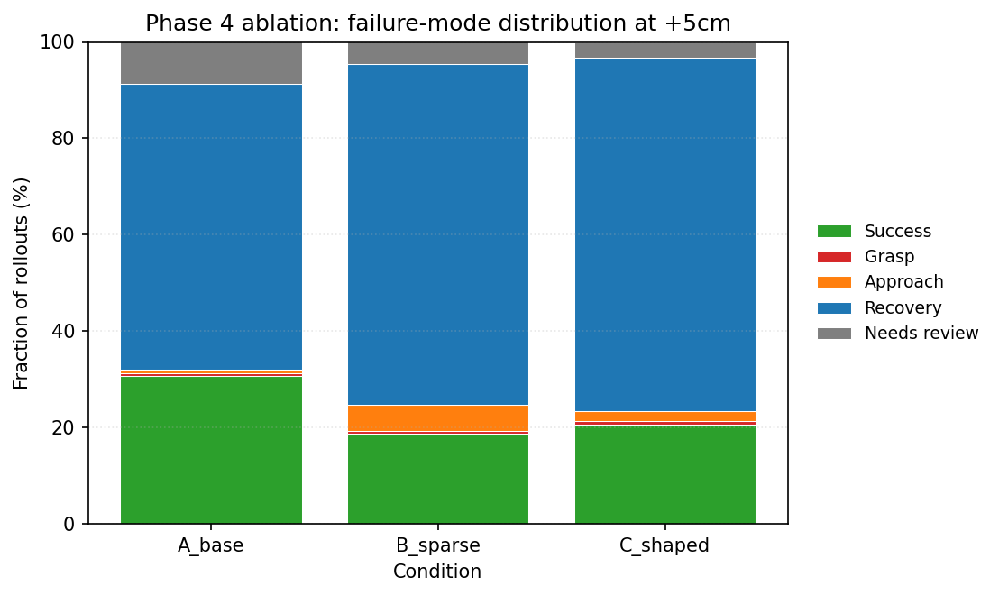

# When residual RL made ACT worse: a 13-point honest null on AlohaTransferCube

<!-- 2026-05-21 · Rubeno Dechua · ~2000 words ·
     Repo: https://github.com/RDechua/roboeval -->

<!-- §1 Lede -->

I spent a month testing how a state-of-the-art imitation learning policy
breaks when you nudge the world. The single biggest failure mode was
**Recovery** — the policy sweeps past the cube without engaging — and at
+5 cm of spatial shift, it accounts for 59% of all rollouts. I built a
residual RL loop on top of the frozen base policy to try to recover those
rollouts. Across two reward shapings and three seeds per arm, the residual
moved the task-success rate **−13.3 pp** under sparse reward and **−10.7 pp**
under shaped. This is the writeup of why that happened and what I'd try next.

<!-- §2 TL;DR box -->

> **TL;DR.** Frozen ACT on the +5 cm spatial cell scored **0.320 mean TSR**
> (3 seeds × 50 rollouts). A PPO residual on top of it scored **0.187**
> with sparse reward (Δ = −13.3 pp; Welch t = −2.95, p_one-sided = 0.034
> for *significant decrease*) and **0.213** with shaped reward (Δ = −10.7 pp;
> t = −1.95, p = 0.062). The residual hurts under both reward shapings. The
> failure mode is diagnosable: PPO drifts off zero with no positive bootstrap,
> α is large enough to compound, and the MLP starts random. The v1.1 fix
> path is concrete — see the end.

## Setup: ACT on AlohaTransferCube
<!-- §3 -->

The base policy is **ACT** (Action Chunking with Transformers), trained on
human demonstrations of the bimanual ALOHA Transfer Cube task and published
by the LeRobot project as
`lerobot/act_aloha_sim_transfer_cube_human`. The model card reports a
task-success rate of 0.83 across 500 sequential seeds; my reproduction with
3 seeds × 50 rollouts lands at 0.80 ± 0.057, well within sampling noise.
Verified, frozen, treated as the ground truth.

The task: two 7-DoF arms pick up a small cube with the right gripper, lift,
transfer to the left gripper, and place it. The simulator is `gym_aloha`'s
MuJoCo build; observations are 14-DoF agent positions plus three RGB cameras;
actions are absolute joint targets in [-1, 1]. Each episode runs up to 400
steps and terminates on a same-step contact between the left gripper and the
cube once the cube is above a calibrated z-threshold.

I evaluate against a custom **geometric** task-success rate (`mean_tsr_custom`)
that thresholds on cube position rather than environment reward. The custom
criterion calibrates `target_xy` and `xy_tolerance` from 50 nominal rollouts
and freezes them at `data/calibration/transfer_cube_target_xy.json`. This
removes one degree of freedom from the success signal — there's no debate
about whether a near-miss counts.

Why a 2026 reader should care: ACT is the cheapest competent bimanual
manipulation policy published this year, every robot-learning lab in PRD §4.1
is either using or replacing it, and "what does it break on" is the question
underneath nearly every Robot Learning Engineer interview I've seen.

## Why +5 cm? What an evaluation harness told me
<!-- §4 — embeds docs/figures/cross_axis_degradation.png -->

Before reaching for residual RL, I built an evaluation harness with two
perturbation axes. **Spatial:** translate the cube's initial XY pose by
±1, ±3, ±5 cm. **Temporal:** delay the action chunk by 1, 3, or 5 env
steps. Same base policy, same 150 rollouts per cell, same geometric
success criterion. The story turned out to be asymmetric across axes:



*ACT's mean task-success rate vs perturbation magnitude. Left: spatial
cube shifts in cm; 67 pp drop at -5 cm vs nominal. Right: action-chunk
delays in env steps; only 11 pp drop at 5 steps. ±σ shaded across 3 seeds
× 50 rollouts per cell.*

**Spatial is brittle.** Pull the cube 5 cm in either direction and TSR
collapses; the curve is nonlinear and asymmetric, with the negative
direction degrading harder (12.7% at -5 cm versus 30.7% at +5 cm).
**Temporal is robust.** A 5-step delay only costs 11 pp — ACT's 100-step
action chunking absorbs latency that would wreck a stateless policy.

The failure-mode classifier I ran on every rollout (PRD §7.2 taxonomy:
Success / Grasp / Approach / Recovery / Oscillation / Timeout / Visual
confusion) gave a clearer signal still: under both axes the dominant
failure was **Recovery** — the gripper moves into roughly the right region
and then sweeps through without engaging. At +5 cm spatial that single
mode accounts for **59% of all rollouts**. One failure mode that the base
policy reliably reproduces is the cleanest possible target for a residual
correction; everywhere else on the perturbation grid the failures were
multi-modal and harder to attack. So: +5 cm spatial.

## The hypothesis: a small additive residual
<!-- §5 — embeds the mermaid diagram -->

```mermaid
flowchart LR
    O[observation o_t] --> ACT[Frozen ACT base]
    O --> R[Residual MLP δ_θ(o_t)]
    ACT --> S[a_base]
    R --> SCALE[× α = 0.05]
    S --> SUM((+))
    SCALE --> SUM
    SUM --> A[a_t = a_base + α · δ_θ]
```

*Per-step composition: ACT's frozen action plus an MLP residual scaled
by α = 0.05. PPO learns δ_θ to maximize the reward.*

The architecture is small on purpose. The residual is a two-layer GELU MLP
(256 → 256) emitting a 6-d correction in joint-target space, scaled by
α=0.05. With ACT's per-dim action std around σ=0.135, that bounds the
residual's per-step perturbation at roughly ±0.007 — small enough, I
thought, that it would either help or do nothing.

I ran two reward shapings as a paired ablation. **Sparse:** +1 on the
geometric success criterion firing, 0 otherwise. **Shaped:** sparse plus a
distance-shaping term `-w · ‖cube_xy - target_xy‖₂` with `w = 1.0`,
matching the PRD §8 design. The intent was to check whether sparse reward
was the limiting factor; the alternative hypothesis was that the residual
just lacks signal.

## The experiment
<!-- §6 -->

Three conditions × 3 seeds × 50 rollouts = **450 rollouts** total.

- **A** (control): frozen ACT only, no residual. `act_spatial_y+5cm.yaml`. W&B run `w6k2wole`.
- **B** (sparse): frozen ACT + residual PPO trained for ~500 k env steps
  with the sparse reward. `residual_ppo_y+5cm_sparse.yaml`. Eval run
  `o6ukyo53`.
- **C** (shaped): same architecture and training budget, shaped reward.
  `residual_ppo_y+5cm_shaped.yaml`. Eval run `43czuigy`.

I report mean ± std of `mean_tsr_custom` across the three seed groups for
each arm, plus a one-sided Welch's t-test comparing each residual arm to
condition A (null hypothesis: arm ≤ A; alternative: arm > A; rejection
means the residual *helps*). I also report the per-rollout failure-mode
distribution from the PRD §7.2 classifier. All raw evidence — `eval_results_*.json`,
`auto_labels_*.json`, the aggregator output — is committed under
`outputs/` and `data/taxonomy/`, and the live dashboard at
`huggingface.co/spaces/rubenodechua/roboeval` exposes the same numbers
interactively.

## Result: the residual hurt the base
<!-- §7 — embeds docs/figures/phase4_ablation_failure_distribution.png -->

The headline numbers (mean ± std across 3 seed groups, n=50 each):

| Arm | Mean TSR | Δ vs A | Welch's t | p (one-sided, residual > A) |
|---|---|---|---|---|
| A — frozen base | 0.320 ± 0.059 | — | — | — |
| B — residual, sparse | 0.187 ± 0.025 | **−13.3 pp** | −2.95 | 0.966 |
| C — residual, shaped | 0.213 ± 0.050 | **−10.7 pp** | −1.95 | 0.938 |

Both residual arms fall below the base. The one-sided p-values above
test "the residual helps"; flip the alternative and the negative effect
is significant at p ≈ 0.03 (sparse), borderline at p ≈ 0.06 (shaped).
Per-seed spread is tight (0.025 sparse) — this is signal, not noise.

The failure-mode distribution is the more informative half of the result:



*Failure-mode distribution at +5 cm spatial. The residual under both
reward shapings shrinks the success bucket and grows Recovery; Approach
failures jump 7× under sparse reward. 150 rollouts per condition,
3 seeds × 50.*

Three qualitative shifts stand out. **Success** collapses from 30.7%
(base) to 18.7% (sparse) / 21.3% (shaped). **Recovery** grows from 59.3%
to 70.7% / 73.3% — the residual is making the dominant failure *more*
dominant. And **Approach failures** jump from 0.7% (base) to 5.3%
(sparse) — a 7× increase. The residual is not just adding jitter; it is
occasionally yanking the gripper away from the cube. That's a directional
miscorrection, not noise. The next section asks why.

## Why it hurt: diagnosing the four levers
<!-- §8 -->

Residual RL on a frozen base policy has four design knobs: the base, the
reward, the blend coefficient α, and the residual network's initialization.
Reasoning through each:

**The base.** ACT at +5 cm scored 30.7% — already in the long-tail regime
where 59% of rollouts are Recovery. There isn't much *headroom* for a
small additive correction here; the cube is far enough from the trained
distribution that the base's joint targets are pointing at the wrong
position to begin with. A small residual cannot fix a large pose error;
it can only nudge a near-miss into a hit. **The base policy was probably
too broken at this cell for a same-architecture additive fix.**

**The reward.** The sparse reward is +1 only on the success criterion
firing — and at this cell, only 19% of *the residual's own training
rollouts* fired the criterion. That's a sparse-reward dead zone:
PPO's advantage estimates are dominated by terminal value, the policy
gradient is mostly noise, and the entropy bonus drifts the mean
nonzero. The shaped reward was supposed to fix that, and it does narrow
the gap (−10.7 pp vs. −13.3 pp), but not close it. **Reward shaping
helped a little; it didn't get over the hump.**

**Alpha.** α=0.05 × σ=0.135 gives a per-dim perturbation of about ±0.007.
That's small per step but compounds: ACT runs ~385 steps to success and
the residual integrates an action perturbation every one of them. If
PPO's mean has drifted by even 0.05 of a standard deviation in a
*consistent direction*, the gripper accumulates several centimeters of
trajectory error before the episode ends. The Approach-failure jump under
sparse reward is exactly what this looks like geometrically.

**The init.** The residual MLP starts with default He-uniform weights and
a learnable log-σ initialized at -2 (per SB3 defaults). At t=0 the
network's output is small-but-random, not zero. PPO has to learn "do
nothing" from scratch, in a sparse-reward regime, which is harder than
learning a correction. **The residual never gets to "no harm" as a
lower bound** — and "no harm" is what α should buy us in principle.

Three of those four levers have concrete v1.1 fixes. Below.

### Limitations

Three honest caveats. **(1) Single base policy.** I evaluated only ACT;
diffusion-policy results may differ both quantitatively and in failure
morphology. **(2) Single cell.** The ablation ran at +5 cm spatial only.
The architectural fixes above need re-running at +1 and +3 cm where the
base has more headroom before we can claim they generalise. **(3) Small
N.** 3 seeds × 50 rollouts per arm is enough for the qualitative story
but the Welch's t p-values are wide because df ≈ 3; a follow-up should
run 5+ seed groups to tighten the confidence intervals.

## What I'd try next (v1.1)
<!-- §9 — closes with code/dashboard/docs links -->

The diagnosis points at four concrete fixes, ordered by leverage:

**Distillation-init residual** (top priority, smallest change). Zero the
output-layer weights and bias of `ResidualMLP` and shrink the rest by 0.1
at construction time. The policy now starts as "do nothing" — α · δ is
~0 for the first thousands of PPO steps, so the base policy's performance
is a strict lower bound. This is a one-line `nn.init.zeros_` change in
`roboeval/residual/policy.py`. It directly addresses lever 4.

**Co-trainable α.** Move α out of the YAML and into the residual policy
as a `nn.Parameter` with a small initial value (0.01) and an `L2`
penalty. PPO learns when to use the residual rather than always
saturating it. This addresses lever 3 and pairs naturally with the
distillation init — together they bound the residual's worst case to
"no harm."

**ACT-encoder features.** The current residual reads raw 14-DoF agent
positions. Wire the residual's input through ACT's transformer encoder
(via the `feature_extractor` slot the codebase already has) so it sees
the same vision-conditioned representation the base does. This should
make the residual sim-to-real portable and addresses lever 1 by sharing
the base's perceptual prior.

**Smaller perturbation cells.** Re-run the ablation at +1 cm and +3 cm
where the base still has 72% and 55% TSR respectively. There's actual
headroom there for an additive correction; if the residual *still* hurts
in that regime, the architectural story above is wrong and we have
something interesting to chase.

The eval harness, classifier, training loop, aggregator, and dashboard are
all in place to run any of these in an afternoon. Repo:
[github.com/RDechua/roboeval](https://github.com/RDechua/roboeval)
(PRD, week-by-week log, and the full Phase 4 writeup are under `docs/`).
Live dashboard:
[huggingface.co/spaces/rubenodechua/roboeval](https://huggingface.co/spaces/rubenodechua/roboeval).

If you're hiring for evaluation engineering or residual RL, my email is
in the GitHub profile.
